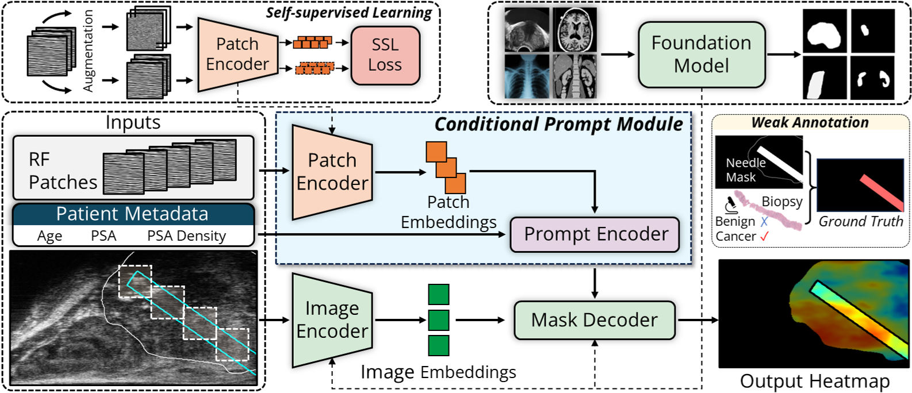
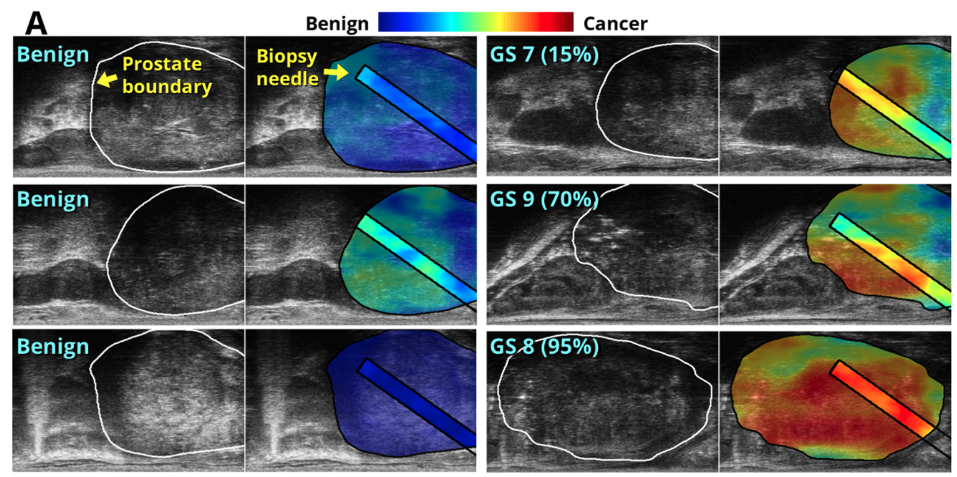

# ProstNFound: Enhancing Foundation Models for Prostate Cancer Detection

ProstNFound is an innovative method designed to improve the accuracy of prostate cancer (PCa) detection using high-resolution micro-ultrasound data and deep learning techniques. By combining the robustness of medical foundation models with specialized domain-specific knowledge, ProstNFound demonstrates significant improvements in detecting PCa, offering performance competitive with expert radiologists.

## Overview

Medical foundation models, pre-trained on extensive and diverse datasets, provide a strong knowledge base that can be adapted to various downstream tasks. However, their generality often limits their effectiveness in specialized domains like PCa detection. ProstNFound addresses this challenge by integrating domain-specific knowledge into foundation models, specifically tailored for ultrasound imaging and PCa detection.

### Key Features

- **Domain-Specific Knowledge Integration**: Specialized auxiliary networks embed high-resolution textural features and clinical markers into the foundation model, enhancing its performance.
- **Improved Detection Accuracy**: ProstNFound achieves 90% sensitivity at 40% specificity, demonstrating significant improvements over state-of-the-art models.
- **Clinical Relevance**: Performance competitive with expert radiologists reading multi-parametric MRI or micro-ultrasound images, suggesting significant promise for clinical application.

### Methodology



The figure above illustrates the methodology of ProstNFound. 
ProstNFound integrates a B-mode image encoder with a conditional prompt module that embeds raw RF patch data (using a CNN patch encoder) and patient metadata. These embeddings are fed into a mask decoder to generate a cancer likelihood heatmap. The training process uses histopathology labels in the needle region. The patch encoder is initialized through self-supervised pretraining, while the image encoder and mask decoder are initialized from a medical image foundation model.

### Dataset

ProstNFound was evaluated using a multi-center micro-ultrasound dataset comprising 693 patients. This diverse dataset provided a robust basis for training and testing the model, ensuring its generalizability across different clinical settings.

### Results

ProstNFound's integration of specialized auxiliary networks and foundation models has led to:

- **90% Sensitivity at 40% Specificity**: Indicating a high detection rate of prostate cancer with a reasonable level of false positives.
- **Comparable Performance to Expert Radiologists**: Demonstrating the potential for ProstNFound to assist or even outperform human experts in clinical settings.



This figure shows a demo of the model outputs, where the model activations localize supicious regions of cancer (right column) confirmed by histopathology (Gleason grade), while showing little to no activations for benign examples (left column).

# Usage

## Installation

To install and use ProstNFound, follow these steps:

1. Clone the repository:
    ```bash
    git clone https://github.com/yourusername/ProstNFound.git
    cd ProstNFound
    ```

2. Create a virtual environment with Python 3.11 or higher:
    ```bash
    conda create --name myEnv --python=3.11
    ```

3. Activate the virtual environment:
    ```bash
    conda activate myEnv
    ```

4. Install the required dependencies:
    ```bash
    pip install -r requirements.txt
    ```

5. Install torch=2.0+ from their website: https://pytorch.org/get-started/locally/

## Dataset Structure

This code requires your dataset to be organized and structured according to the structure outlined in [the data documentation](data/README.md). Please extract your folder into a matching format. 

## Training/Inference
### 1. Patch-based SSL Pretraining 

This stage is optional, and only required for using the patch CNN prompts. While this step adds to the model's performance, we can still obtain good performance when leaving it out, so you may want to disable it in the first version of your experiments for the sake of simplicity. If we want to use it, we have to run a command like the following, we run the self-supervised training stage for the CNN as follows: 

```bash
SPLITS_FILE=data/splits.json # replace this

python train_patch_ssl.py --splits_file=$SPLITS_FILE --batch_size=64 --lr=1e-4 --data_type=rf --name=patch_ssl_pretraining --checkpoint_path=/checkpoint/$USER --save_weights_path=ssl_checkpoints/rf_ssl_weights.pt 
```

This will pretrain the patch CNN model using self-supervised learning and save the best model from the training run to `ssl_checkpoints/rf_ssl_weights.pt`.

Discover additional config options using: 
```bash
python train_patch_ssl.py -h
```

### 2. Main Training

To run the main training, we use the following command (`--sparse_cnn_backbone_path` is optional - if you skipped step 1 exclude this line): 

```bash
# replace these according to your setup
EXP_NAME=my_experiment
EXP_DIR=experiments/${EXP_NAME}
CKPT_DIR=/checkpoint/$USER
SPLITS_FILE=data/splits.json

# run training
python train_prostnfound.py \
    --config_path conf/main_training.json \
    --exp_dir $EXP_DIR \
    --checkpoint_dir $CKPT_DIR \
    --splits_json_path splits/fold${FOLD}:${N_FOLDS}.json \
    --prompt_table_csv_path prompt_table.csv \
    --sparse_cnn_backbone_path ssl_checkpoints/rf_ssl_weights.pt \
    --name $EXP_NAME &
```

to see the full list of options, you can run `python train_prostnfound.py -h`. It is also possible to edit fields in the [main config file](conf/main_training.json).

### 3. Evaluation

To run the tests (full metric calculation for the test set, heatmap generation, etc. ) for the trained model, you will run `test_prostnfound.py`. For example: 
```bash
python test_prostnfound.py \
    -c /fs01/home/pwilson/projects/prostNfound/experiments/fold-0_reprod/12676934/checkpoints/config.json \
    -m /fs01/home/pwilson/projects/prostNfound/experiments/fold-0_reprod/12676934/checkpoints/best_model.ckpt \
    -o .test
```
Here we would replace `-c` with the path to the config file output by the script we ran in step 2, `-m` by the path to the best_model saved by step 2. and `-o` by the path to our desired output directory for the tests.

## License

This project is licensed under the MIT License. See the [LICENSE](LICENSE) file for details. It depends on a few libraries stored in the `vendor` folder of this source tree - licencing information for these is stored in that folder.

## Contact

For questions or support, please open an issue in this repository or contact us at [pfrwilson@gmail.com](mailto:pfrwilson@gmail.com).

---

We hope ProstNFound will significantly enhance the capabilities of medical foundation models in the detection of prostate cancer, ultimately improving clinical outcomes. Thank you for your interest and contribution!